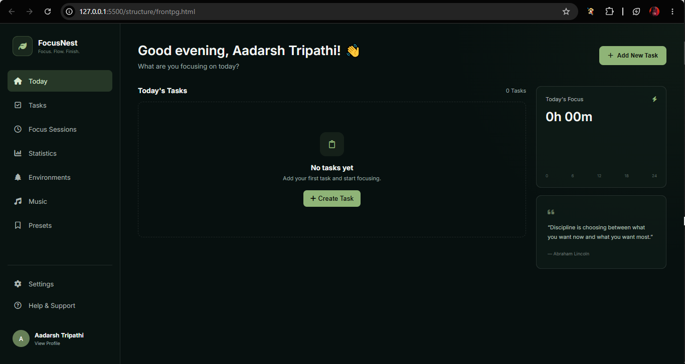
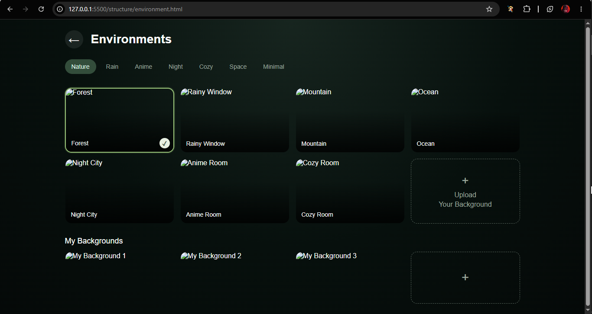
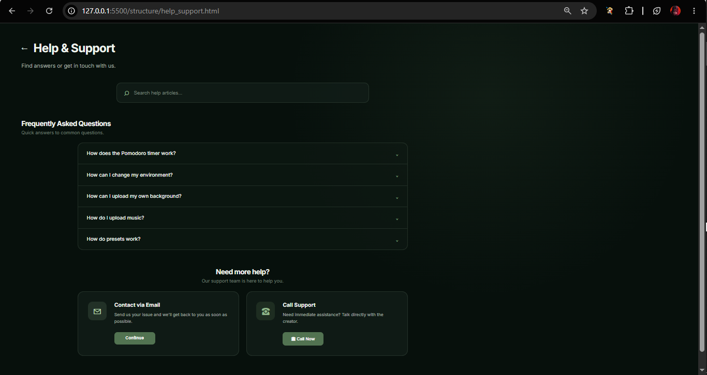

# 🌿 FocusNest

> **Plan. Focus. Accomplish.**

FocusNest is a productivity and focus-management web application designed to help users organize their tasks, stay focused, and track their productivity. It combines **task management, Pomodoro-based focus sessions, customizable environments, task-specific music, and productivity statistics** into one personalized workspace.

---

## 📸 Preview / Screenshots

### 🏠 Dashboard


### ⏱️ Focus Session


### 🌲 Environment


### 📊 Help & Support


---

## ✨ Features

### 📝 Task Management

* Create and manage tasks
* Mark tasks as completed
* Track task progress
* Assign focus sessions to individual tasks

### ⏱️ Pomodoro Focus Timer

* Dedicated focus timer for each task
* Start, pause, resume, and reset sessions
* Track focused time
* Customize focus duration

### 🔄 Custom Focus Sessions

* Set your preferred focus duration
* Customize break duration
* Configure the number of focus sessions
* Create a personalized productivity routine

### 🌿 Environment Themes

Choose an environment according to your mood and preference:

* 🌲 Forest
* 🌧️ Rain
* 🌸 Anime
* 🌙 Night
* ☕ Cozy
* 🌌 Space
* ⚪ Minimal

### 🎵 Task-Specific Music

* Add music for individual tasks
* Play music while focusing
* Create a personalized focus atmosphere

### 📊 Productivity Statistics

* Track completed tasks
* Monitor focus time
* View productivity progress
* Analyze your daily performance

### 🖼️ Custom Backgrounds

* Upload your own background images
* Personalize your focus environment
* Switch between different environments

### 📱 Responsive Design

FocusNest is designed to work across different screen sizes, including:

* 💻 Desktop
* 📱 Mobile
* 💻 Laptop
* 📟 Tablet

---

## 🛠️ Tech Stack

| Technology     | Purpose                                 |
| -------------- | --------------------------------------- |
| **HTML5**      | Web page structure                      |
| **CSS3**       | Styling, animations & responsive design |
| **JavaScript** | Application logic & interactivity       |
| **MongoDB**    | Database & data storage                 |

---

## 📂 Project Structure

```text
FocusNest/
│
├── 📁 structure/
│ ├── frontpg.html
│ ├── focus-session.html
│ ├── environment.html
│ ├── support.html
│ └── structure.html
│
├── 📁 style/
│ ├── style.css
│ ├── frontstyle.css
│ ├── environment.css
│ └── focustyle.css
│
├── 📁 script/
│ ├── focuscript.js
│ ├── environment.js
│ └── script.js
│
├── 📁 assets/
│ ├── images/
│ ├── backgrounds/
│ ├── music/
│ └── icons/
│
└── 📄 README.md
```
## 🎯 How It Works

FocusNest follows a simple productivity workflow:

```text
        ┌──────────────┐
        │     Login    │
        └──────┬───────┘
               ↓
        ┌──────────────┐
        │   Add Task   │
        └──────┬───────┘
               ↓
        ┌──────────────┐
        │ Start Focus  │
        └──────┬───────┘
               ↓
        ┌──────────────┐
        │ Environment  │
        │  & Music     │
        └──────┬───────┘
               ↓
        ┌──────────────┐
        │ Complete Task│
        └──────┬───────┘
               ↓
        ┌──────────────┐
        │  Statistics  │
        └──────────────┘
```

### Workflow

1. **Login** to your FocusNest workspace.
2. **Create tasks** that you want to complete.
3. Select a task and **start a Focus Session**.
4. Choose an **environment** and optional music.
5. Work during the focus session.
6. **Complete the task** after finishing.
7. Check **statistics** to monitor your productivity.

---
## 🔮 Future Enhancements

The following features can be added in future versions of FocusNest:

* 🔐 Secure user authentication
* ☁️ Cloud data synchronization
* 🌿 More environment themes
* 🎵 Expanded music library
* 📈 Advanced productivity analytics
* 📅 Daily and weekly productivity reports
* 🔔 Focus session notifications
* 🏆 Productivity goals and achievements
* 📱 Dedicated mobile application
* 👥 User profiles and personalized settings

---

## 👨‍💻 Contributors

**FocusNest Development Team**

* Aadarsh Tripathi

---

## 📄 License

This project is developed for educational and portfolio purposes.

---

## ⭐ Support

If you find **FocusNest** useful or interesting, consider giving the repository a ⭐ on GitHub!

> **FocusNest — Create your space. Find your focus. Get things done.** 🌿

